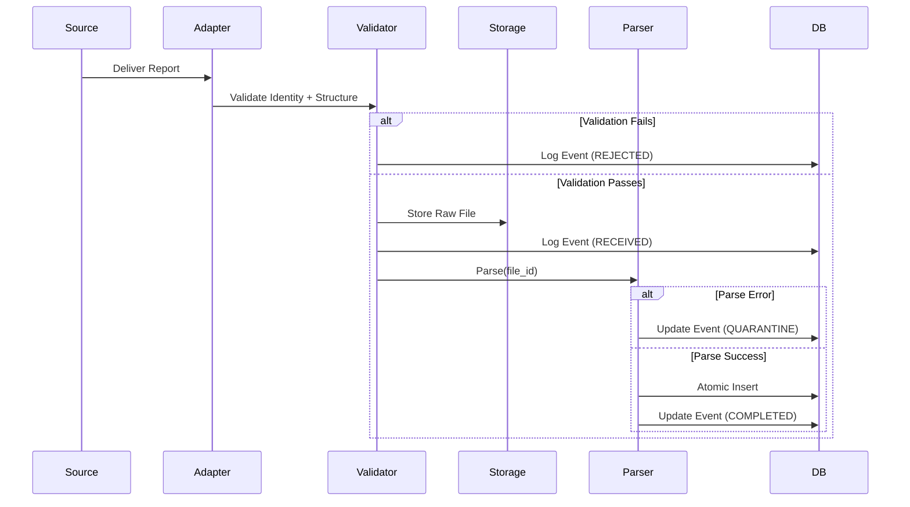
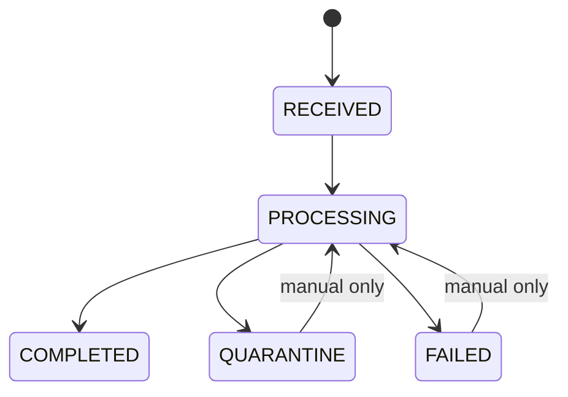

# PRODUCT REQUIREMENTS DOCUMENT (PRD)

**Product:** Saddle AdPulse  
**Module:** Dual-Play Ingestion Infrastructure (Email-First, API-Ready)  
**Document Type:** Foundational Infrastructure PRD  
**Version:** 1.2 (Fail-Safe, Build-Ready)  
**Owner:** Founder  
**Status:** Approved for Engineering — Frozen  

---

## TABLE OF CONTENTS

1. [Purpose & Scope](#1-purpose--scope)
2. [Guiding Principles (Non-Negotiables)](#2-guiding-principles-non-negotiable)
3. [Definitions & Terminology](#3-definitions--terminology)
4. [System Overview & Architecture](#4-system-overview--architecture)
5. [Supported Ingestion Sources](#5-supported-ingestion-sources)
6. [Account Identification & Security Model](#6-account-identification--security-model)
7. [Email Ingestion Adapter (Phase 1)](#7-email-ingestion-adapter-phase-1)
8. [API Ingestion Adapter (Future)](#8-api-ingestion-adapter-future)
9. [Validation Layer (Source-Agnostic)](#9-validation-layer-source-agnostic)
10. [Raw File Storage Layer](#10-raw-file-storage-layer)
11. [Parsing Engine & Field Mapping (Technical Spec)](#11-parsing-engine--field-mapping)
12. [Normalized Data Load & Schema (Technical Spec)](#12-normalized-data-load--schema)
13. [Ingestion History & Auditability](#13-ingestion-history--auditability)
14. [Ingestion State Machine & Concurrency Control](#14-ingestion-state-machine--concurrency-control)
15. [Schedule Detection & Monitoring](#15-schedule-detection--monitoring)
16. [Failure Handling & Quarantine Flow](#16-failure-handling--quarantine)
17. [Replay, Reprocessing & Backfill Semantics](#17-replay-reprocessing--backfill-semantics)
18. [Alerting & Notification System](#18-alerting--notification-system)
19. [Manual Upload (Fallback Path)](#19-manual-upload-fallback-path)
20. [Data Retention & Purge Policy](#20-data-retention--purge-policy)
21. [Access Control & User Visibility](#21-access-control--user-visibility)
22. [Non-Goals](#22-non-goals)
23. [Phased Delivery Plan](#23-phased-delivery-plan)
24. [Success Metrics](#24-success-metrics)
25. [Change Control Rules](#25-change-control-rules)

---

## 1. PURPOSE & SCOPE

### Purpose
To define a single ingestion infrastructure that:
- Works today via email.
- Supports Amazon API ingestion later.
- Avoids re-architecture or logic duplication.
- Guarantees traceability, replayability, and data integrity.

### Scope
**Includes:** Ingestion, Validation, Storage, Parsing, Loading, Alerting, Retention  
**Excludes:** Optimization logic, Impact modeling, UI design beyond ingestion visibility

---

## 2. GUIDING PRINCIPLES (NON-NEGOTIABLE)

1. **Adapters are swappable. Core logic is not.**
2. **No data is ever discarded silently.**
3. **Failures alert operators before users.**
4. **Raw data must always be recoverable.**
5. **Email is a transport, not a dependency.**
6. **Every ingestion is auditable.**
7. **Reprocessing must be deterministic and idempotent.**

> [!CAUTION]
> Any implementation that violates these principles is incorrect.

---

## 3. DEFINITIONS & TERMINOLOGY

| Term | Definition |
|------|------------|
| **Ingestion Event** | One attempt to process a report |
| **Raw File** | Original CSV as received (immutable) |
| **Adapter** | Source-specific ingestion mechanism |
| **Validation** | Identity + structural checks before parsing |
| **Quarantine** | Stored but unprocessed file due to errors |
| **Operator** | Internal team (Founder/Admin) |
| **Replay** | Reprocessing an existing raw file |

---

## 4. SYSTEM OVERVIEW & ARCHITECTURE

### Conceptual Flow

```
SOURCE → Adapter → Validator → Raw Store → Parser → DB
```



---

## 5. SUPPORTED INGESTION SOURCES

```python
enum IngestionSource {
  EMAIL,
  API,
  MANUAL
}
```

> [!IMPORTANT]
> **Rule:** All sources must converge into the same validation, storage, and parsing pipeline.

---

## 6. ACCOUNT IDENTIFICATION & SECURITY MODEL

### Identifiers
- System-generated UUID per account
- Email format: `str-{uuid}@ingest.saddle.ai`

### Validation Logic (LOCKED)

**PASS if:**
1. UUID maps to an active account
2. Sender email ∈ `allowed_sender_emails`

> [!WARNING]
> **DO NOT:**
> - Infer account from file contents
> - Allow wildcard sender domains

---

## 7. EMAIL INGESTION ADAPTER (PHASE 1)

### Responsibilities
1. Receive email
2. Extract metadata
3. Extract attachment
4. Forward payload to Validation Layer

### Failure Conditions
| Condition | Action |
|-----------|--------|
| No attachment | Log as REJECTED |
| Multiple attachments | Log as REJECTED |
| Non-CSV attachment | Log as REJECTED |

---

## 8. API INGESTION ADAPTER (FUTURE)

### Responsibilities
1. Authenticate with Amazon
2. Fetch STR data
3. Emit identical payload as Email Adapter

> [!NOTE]
> **Constraint:** Validator must be source-agnostic.

---

## 9. VALIDATION LAYER (SOURCE-AGNOSTIC)

### Validation Types
1. **Identity validation** — Account exists and sender is authorized
2. **Structural validation** — File format and required columns present
3. **Duplicate detection** — See [§14](#14-ingestion-state-machine--concurrency-control)

### Failures
- Logged
- Quarantined
- Alerted to Operator

---

## 10. RAW FILE STORAGE LAYER

### Interface (MANDATORY)

```python
put(file_object, metadata) -> file_id
get(file_id) -> file_object
```

| Phase | Provider |
|-------|----------|
| Phase 1 | Supabase |
| Phase 3+ | S3 |

> [!IMPORTANT]
> Business logic must not reference provider directly.

---

## 11. PARSING ENGINE & FIELD MAPPING

### CSV Normalization Rules
- Headers → `snake_case`
- Strip currency symbols ($, £, €, AED)
- Strip percent symbols (%)

### Required Header Mapping

| Amazon Header | Internal Field | Type | Required |
|---------------|----------------|------|----------|
| Date / Day | `report_date` | DATE | YES |
| Campaign Name | `campaign_name` | STRING | YES |
| Ad Group Name | `ad_group_name` | STRING | YES |
| Customer Search Term | `search_term` | STRING | YES |
| Impressions | `impressions` | INT | YES |
| Clicks | `clicks` | INT | YES |
| Spend | `spend` | DECIMAL | YES |

### Partial Parse Tolerance
| Condition | Action |
|-----------|--------|
| ≤1% malformed rows | Drop rows, continue |
| >1% malformed rows | QUARANTINE entire file |

### Parser Logging Requirements
- `dropped_row_count`
- `warnings[]`

---

## 12. NORMALIZED DATA LOAD & SCHEMA

### Constraints
- **Atomic inserts** — All or nothing
- **Idempotent by ingestion_id** — Reprocessing replaces, not appends

### `search_terms` Table (MVP)

| Column | Type | Notes |
|--------|------|-------|
| `id` | UUID | PK |
| `account_id` | UUID | FK → accounts |
| `ingestion_id` | UUID | FK → ingestion_events |
| `report_date` | DATE | |
| `campaign_name` | VARCHAR | |
| `ad_group_name` | VARCHAR | |
| `search_term` | TEXT | |
| `impressions` | INTEGER | |
| `clicks` | INTEGER | |
| `spend` | DECIMAL | |
| `created_at` | TIMESTAMP | |

---

## 13. INGESTION HISTORY & AUDITABILITY

### `ingestion_events` Table

| Column | Type | Notes |
|--------|------|-------|
| `ingestion_id` | UUID | PK |
| `account_id` | UUID | FK → accounts |
| `source` | ENUM | EMAIL, API, MANUAL |
| `status` | ENUM | See state machine |
| `received_at` | TIMESTAMP | |
| `processed_at` | TIMESTAMP | |
| `raw_file_path` | VARCHAR | Reference to storage |
| `failure_reason` | TEXT | |
| `metadata` | JSONB | Sender, filename, etc. |

---

## 14. INGESTION STATE MACHINE & CONCURRENCY CONTROL

### Valid State Transitions



> [!CAUTION]
> Invalid transitions are forbidden.

### Duplicate Protection
```python
source_fingerprint = hash(sender + filename + date_range)
```

- Enforce uniqueness per account
- Duplicates logged as `DUPLICATE_IGNORED`
- Not parsed
- No alerts

---

## 15. SCHEDULE DETECTION & MONITORING

### Learning Cadence
- Learn cadence after **3 successful ingestions**
- Mark as **LATE** if:

```
now > last_ingestion + expected_interval + 12h
```

---

## 16. FAILURE HANDLING & QUARANTINE

### Flow
```
FAIL → Store raw → Log QUARANTINE → Alert Operator → Await action
```

### Operator Actions
| Action | Description |
|--------|-------------|
| **Reprocess** | Re-run parser on same raw file |
| **Discard** | Mark as permanently failed |

---

## 17. REPLAY, REPROCESSING & BACKFILL SEMANTICS

### Reprocess Contract
1. `DELETE` normalized rows `WHERE ingestion_id = X`
2. Re-parse same `raw_file_path`
3. Reinsert rows
4. Update `processed_at`
5. **Do NOT** create new `ingestion_id`

### Backfill Mode
- Accept date-range uploads
- Mark ingestion as `BACKFILL`
- Skip schedule alerts

---

## 18. ALERTING & NOTIFICATION SYSTEM

### Alert Routing

| Severity | Operator | User |
|----------|----------|------|
| Critical | Slack + Email | — |
| High | Slack | — |
| Medium | Slack | In-App |
| Low | — | In-App |

### Escalation Rule
- Same `failure_reason` across **≥3 accounts** → Critical

---

## 19. MANUAL UPLOAD (FALLBACK PATH)

- Same pipeline as Email/API
- Date range limited (e.g., 60 days max)
- Explicit overwrite confirmation required

---

## 20. DATA RETENTION & PURGE POLICY

| Data Type | Retention |
|-----------|-----------|
| Raw files | 120 days |
| Normalized data | Forever |

**Purge Schedule:** Monthly job

---

## 21. ACCESS CONTROL & USER VISIBILITY

### Users CAN See
- Ingestion status
- Last updated timestamp

### Users CANNOT See
- Raw files
- Internal logs
- Operator notes

---

## 22. NON-GOALS

- ❌ No real-time ingestion
- ❌ No auto-retries without visibility
- ❌ No email scheduling UI

---

## 23. PHASED DELIVERY PLAN

| Phase | Scope | Description |
|-------|-------|-------------|
| **Phase 1** | Email MVP | Basic email ingestion, parsing, storage |
| **Phase 2** | Automation | Schedule detection, alerting |
| **Phase 3** | Resilience | S3 storage, retry logic |
| **Phase 4** | API Adapter | Amazon Advertising API integration |

---

## 24. SUCCESS METRICS

| Metric | Target |
|--------|--------|
| Ingestion success rate | ≥95% |
| Manual intervention rate | <5% |
| Unrecoverable data loss | Zero |
| New code for API swap | <20% |

---

## 25. CHANGE CONTROL RULES

> [!CAUTION]
> This document is **frozen**.

Any deviation requires:
1. Written justification
2. Founder approval
3. No abstraction boundary violations

---

*Document Version: 1.2 | Last Updated: January 2026*
