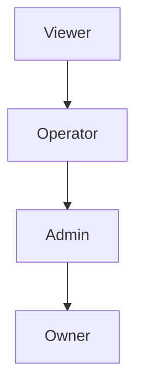

# PRODUCT REQUIREMENTS DOCUMENT (PRD)

**Product:** Saddle AdPulse  
**Module:** Organization, Users, Roles, Seats & Account Limits  
**Document Type:** Foundational Access & Governance PRD  
**Version:** 1.0 (FINAL – FROZEN)  
**Owner:** Founder  
**Status:** APPROVED FOR ENGINEERING  
**Date:** January 2026

---

## TABLE OF CONTENTS

1. [Purpose & Scope](#1-purpose--scope)
2. [Guiding Principles (Non-Negotiables)](#2-guiding-principles-non-negotiables)
3. [Definitions & Terminology](#3-definitions--terminology)
4. [Canonical System Model](#4-canonical-system-model-locked)
5. [Organization Model](#5-organization-model)
6. [User (Seat) Model](#6-user-seat-model)
7. [Role & Permission Model](#7-role--permission-model-locked)
8. [Amazon Account (Client / Store) Model](#8-amazon-account-model)
9. [Subscription, Seats & Billing Model](#9-subscription-seats--billing-model)
10. [Enforcement Rules (What Is Hard vs Soft)](#10-enforcement-rules)
11. [User Creation & Onboarding Flow](#11-user-creation--onboarding-flow)
12. [Login & Authentication Rules](#12-login--authentication-rules)
13. [UX Requirements](#13-ux-requirements)
14. [Backend & Middleware Requirements](#14-backend--middleware-requirements)
15. [Database Schema (Final)](#15-database-schema-final)
16. [Edge Cases & Safety Rules](#16-edge-cases--safety-rules)
17. [Explicit Non-Goals](#17-non-goals-explicit)
18. [Phased Delivery Plan](#18-phased-delivery-plan)
19. [Success Metrics](#19-success-metrics)
20. [Change Control Rules](#20-change-control-rules)

---

## 1. PURPOSE & SCOPE

### Purpose

Define a clean, scalable access-control and billing-aware governance system that supports:
- Agencies and individual sellers
- Per-user (seat) billing
- Hard caps on Amazon accounts
- Role-based permissions
- Zero ambiguity for engineering, sales, or users

### Scope

**Includes:**
- Organizations
- Users (seats)
- Roles & permissions
- Amazon account limits
- Seat-based billing signals
- UX + backend enforcement

**Excludes:**
- Billing provider implementation details (Stripe logic)
- Client-only portals
- Per-account granular RBAC
- Enterprise SSO

---

## 2. GUIDING PRINCIPLES (NON-NEGOTIABLES)

1. **Organizations own Amazon accounts.** Users do not.
2. **Amazon accounts are the primary usage cap.**
3. **Seats (users) are billable but not access-capped.**
4. **Roles are hierarchical and cumulative.**
5. **Monetization ≠ access control.**
6. **No silent limits** — all caps must be visible in UI.
7. **Phase 1 prioritizes simplicity over granularity.**

> [!CAUTION]
> Any implementation violating these principles is incorrect.

---

## 3. DEFINITIONS & TERMINOLOGY

| Term | Definition |
|------|------------|
| **Organization** | A paying entity (Agency or Individual Seller) |
| **User / Seat** | A login identity belonging to an organization |
| **Role** | A permission bundle assigned to a user |
| **Amazon Account** | A seller + marketplace unit |
| **Account Cap** | Max Amazon accounts allowed by plan |
| **Seat** | A billable user (except Viewer, optional) |

---

## 4. CANONICAL SYSTEM MODEL (LOCKED)

```
Organization
├── Users (Seats)
│   └── Role (Owner / Admin / Operator / Viewer)
└── Amazon Accounts
```

### Rules
- Organizations own everything
- Users never own accounts
- All users can see all accounts (v1)
- Role controls actions, not visibility

---

## 5. ORGANIZATION MODEL

### Attributes

| Column | Type | Notes |
|--------|------|-------|
| `id` | UUID | Primary Key |
| `name` | VARCHAR | Organization name |
| `type` | ENUM | `AGENCY`, `SELLER` |
| `subscription_plan` | VARCHAR | Plan identifier |
| `amazon_account_limit` | INT | Max accounts allowed |
| `seat_price` | DECIMAL | Per-seat monthly cost |
| `status` | ENUM | `ACTIVE`, `SUSPENDED` |
| `created_at` | TIMESTAMPTZ | |

---

## 6. USER (SEAT) MODEL

### Core Rules
- Unlimited users per organization
- Users belong to exactly one organization
- Seats are billable, not capped
- Login sharing is not technically blocked (v1)

### Attributes

| Column | Type | Notes |
|--------|------|-------|
| `id` | UUID | Primary Key |
| `organization_id` | UUID | FK to organizations |
| `email` | VARCHAR | Unique |
| `role` | ENUM | User's role |
| `billable` | BOOLEAN | Affects invoice |
| `status` | ENUM | `ACTIVE`, `DISABLED` |
| `last_login_at` | TIMESTAMPTZ | |
| `created_at` | TIMESTAMPTZ | |

---

## 7. ROLE & PERMISSION MODEL (LOCKED)

### Role Hierarchy (CUMULATIVE)



> Higher roles inherit all lower permissions.

---

### Role Definitions

#### 👑 Owner
- Full system access
- Billing & subscription management
- Add/remove users
- Change user roles
- Delete organization

#### 🛠 Admin
- Everything Operator can do
- Add/remove Amazon accounts
- Configure ingestion
- Invite users

**Cannot:**
- Manage billing
- Delete organization

#### ⚙️ Operator
- Run optimizations
- Upload files (manual ingestion)
- Trigger ingestion
- View dashboards
- Download reports

**Cannot:**
- Manage users
- Manage accounts
- Access billing

#### 👀 Viewer
- Read-only access
- Dashboards & reports only

**Cannot:**
- Execute actions
- Upload files
- Modify settings

---

## 8. AMAZON ACCOUNT MODEL

### Definition

An **Amazon Account** = Seller + Marketplace

### Attributes

| Column | Type | Notes |
|--------|------|-------|
| `id` | UUID | Primary Key |
| `organization_id` | UUID | FK to organizations |
| `display_name` | VARCHAR | User-friendly name |
| `marketplace` | VARCHAR | e.g., UAE, US, UK |
| `status` | ENUM | `ACTIVE`, `DISABLED` |
| `created_at` | TIMESTAMPTZ | |

### Visibility
- All users see all accounts
- Enforcement is action-based, not visibility-based

---

## 9. SUBSCRIPTION, SEATS & BILLING MODEL

### Two Independent Dimensions (LOCKED)

| Dimension | Purpose | Enforced Where |
|-----------|---------|----------------|
| **Amazon Accounts** | Usage control | Product layer |
| **Seats (Users)** | Monetization | Billing layer |

---

### Pricing Logic (Agency)

- **Platform fee:** $499 / month
- **Includes:**
  - Organization
  - Core features
  - Amazon account allowance (e.g. 10)
- **Per-user (seat) fee:** +$X / active user / month
- **Account overage:** +$Y per Amazon account

---

### Billing Rules
- Seats are never blocked
- Seat count affects invoice only
- Amazon accounts are hard-capped

---

## 10. ENFORCEMENT RULES

### Hard Enforcement (Product)
- Add Amazon account → **blocked** if cap reached
- Reactivate disabled account → counts toward cap

### Soft Enforcement (Billing)
- Add user → **always allowed**
- UI must show billing impact

---

## 11. USER CREATION & ONBOARDING FLOW

### Invite Flow

1. Owner/Admin invites user
2. Role assigned
3. UI warns:
   > "Adding this user will increase your monthly bill by $X"
4. User sets password
5. User joins organization

---

## 12. LOGIN & AUTHENTICATION RULES

- Email + password auth
- User scoped to organization on login
- Landing page: Organization dashboard

---

## 13. UX REQUIREMENTS

### Required Screens

#### Organization → Billing
- Amazon accounts used / limit
- Active seats count
- Monthly cost breakdown

#### User Management
- List users
- Roles
- Invite/remove users

#### Amazon Accounts
- List accounts
- Add / disable account
- Limit indicator + upgrade CTA

---

## 14. BACKEND & MIDDLEWARE REQUIREMENTS

- Auth middleware (existing)
- Role-based permission checks
- Account-limit enforcement middleware
- Seat counting for billing (non-blocking)

---

## 15. DATABASE SCHEMA (FINAL)

### organizations

```sql
CREATE TABLE organizations (
    id UUID PRIMARY KEY DEFAULT gen_random_uuid(),
    name VARCHAR(255) NOT NULL,
    type VARCHAR(20) NOT NULL CHECK (type IN ('AGENCY', 'SELLER')),
    subscription_plan VARCHAR(50),
    amazon_account_limit INT NOT NULL DEFAULT 5,
    seat_price DECIMAL(10,2) NOT NULL DEFAULT 0,
    status VARCHAR(20) NOT NULL DEFAULT 'ACTIVE' CHECK (status IN ('ACTIVE', 'SUSPENDED')),
    created_at TIMESTAMPTZ NOT NULL DEFAULT NOW()
);
```

### users

```sql
CREATE TABLE users (
    id UUID PRIMARY KEY DEFAULT gen_random_uuid(),
    organization_id UUID NOT NULL REFERENCES organizations(id),
    email VARCHAR(255) NOT NULL UNIQUE,
    password_hash VARCHAR(255) NOT NULL,
    role VARCHAR(20) NOT NULL CHECK (role IN ('OWNER', 'ADMIN', 'OPERATOR', 'VIEWER')),
    billable BOOLEAN NOT NULL DEFAULT true,
    status VARCHAR(20) NOT NULL DEFAULT 'ACTIVE' CHECK (status IN ('ACTIVE', 'DISABLED')),
    last_login_at TIMESTAMPTZ,
    created_at TIMESTAMPTZ NOT NULL DEFAULT NOW()
);
```

### amazon_accounts

```sql
CREATE TABLE amazon_accounts (
    id UUID PRIMARY KEY DEFAULT gen_random_uuid(),
    organization_id UUID NOT NULL REFERENCES organizations(id),
    display_name VARCHAR(255) NOT NULL,
    marketplace VARCHAR(50) NOT NULL,
    status VARCHAR(20) NOT NULL DEFAULT 'ACTIVE' CHECK (status IN ('ACTIVE', 'DISABLED')),
    created_at TIMESTAMPTZ NOT NULL DEFAULT NOW()
);
```

---

## 16. EDGE CASES & SAFETY RULES

| Scenario | Behavior |
|----------|----------|
| Login sharing | Allowed |
| User removed | Immediate access revoke |
| Plan downgrade | Disable excess accounts |
| Owner removal | Ownership transfer required |

---

## 17. NON-GOALS (EXPLICIT)

- ❌ Per-account RBAC
- ❌ Seat-based access caps
- ❌ Client portals
- ❌ IP/device enforcement
- ❌ White-label access

---

## 18. PHASED DELIVERY PLAN

| Phase | Scope |
|-------|-------|
| **Phase 1** | Org model, Users & roles, Account caps, Seat billing signals |
| **Phase 2** | Usage analytics, Soft abuse detection |
| **Phase 3** | Client portals, Advanced RBAC, Enterprise SSO |

---

## 19. SUCCESS METRICS

- Zero account overages
- No role confusion
- Low support tickets on access
- Sales clarity for agencies

---

## 20. CHANGE CONTROL RULES

> [!CAUTION]
> This PRD is **FROZEN**.

Any change requires:
1. Written justification
2. Founder approval
3. Backward compatibility review

---

## EXECUTIVE SUMMARY (TL;DR)

| Principle | Rule |
|-----------|------|
| **Ownership** | Organizations own Amazon accounts |
| **Caps** | Amazon accounts are capped |
| **Billing** | Seats are billable, not capped |
| **Roles** | Stack downward (cumulative) |
| **Design** | Monetization and access control are decoupled |

---

*Document Version: 1.0 | Last Updated: January 2026 | Status: FROZEN FOR ENGINEERING*
