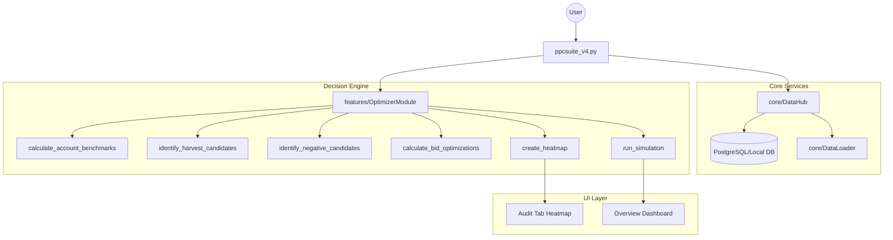

# PPC Suite V4 - Technical Documentation

## 1. Architecture Overview

### System Design
PPC Suite V4 is a consolidated "Decision Hub" built on Streamlit, designed to process Amazon Search Term reports and generate actionable optimizations across Bids, harvests, and negatives.



---

## 2. Optimizer Engine (`features/optimizer.py`)

The Optimizer is the primary logic engine, handling large-scale data processing in six distinct stages.

### Stage 1: Robust Benchmarking
**Function**: `calculate_account_benchmarks(df, config)`

This stage establishes the statistical floors for the entire account.
- **Dynamic CVR Thresholds**: Uses `1 / Account_CVR` to determine expected clicks before negation.
- **Winsorized Median ROAS**:
  1. Filters for "Substantial" rows (Spend ≥ $5).
  2. Clips top 1% of ROAS values at the 99th percentile.
  3. Calculates the median of this Winsorized set.
  * *Reasoning*: Protects against low-spend, high-ROAS outliers skewing bid recommendations.

### Stage 2: Harvest Detection
**Function**: `identify_harvest_candidates(df, config, matcher)`

Identifies search terms that should be elevated to Exact match keywords.
- **Winner Selection**: In case of duplicates, the winner campaign is selected based on ROAS → Sales → Clicks.
- **Standardized Schema**: Always returns a DataFrame with `Harvest_Term`, `Campaign Name`, `Ad Group Name`, and metrics to prevent `KeyError` in downstream modules.

### Stage 3: Negative Identification
**Function**: `identify_negative_candidates(df, config, harvest_df)`

Categorizes "Bleeders" into two severities:
- **🟡 Performance Negative**: High spend, 0 sales, exceeding soft click threshold.
- **🔴 Hard Stop**: Exceeding hard stop threshold (2.5x expected clicks).
- **Isolation Negatives**: Automatically negates any term that was recently harvested into an Exact campaign.

### Stage 4: Bid Optimization (V-Next Bucketed Logic)
**Function**: `calculate_bid_optimizations(df, config, ...)`

Uses a proportional adjustment model:
- **Alpha Factor**: Moderates change speed (default 0.15).
- **Buckets**:
    - **Direct**: Targets with specific Keywords or ASINs.
    - **Aggregated**: Broad/Phrase groupings by parent Target.
    - **Auto**: Categorized separately to ensure specific Auto-targeting types (close-match, etc.) are optimized correctly.

### Stage 5: Audit Heatmap
**Function**: `create_heatmap(df, results)`

Generates a per-AdGroup audit trail. 
- **Action Tracking**: Maps "Actions_Taken" (Harvest, Negate, Bid Change) directly to the campaign structure.
- **Defensive Design**: Explicitly checks for column existence (`Campaign Name`, `Ad Group Name`) to ensure stability even with sparse datasets.

---

## 3. Data Hub & Persistence (`core/data_hub.py`)

**Purpose**: Manages session-persistent data and database interactions.

- **Freshness Control**: Uses `df.copy()` across all entry points to ensure that date filtering in the UI does not pollute the raw data state.
- **Database Integration**: Fetches historical data ranges when the "Include DB Data" toggle is enabled in `ppcsuite_v4.py`.
- **Smart Mapping**: Bridges Search Term reports to Advertised Product reports to provide SKU-level context.

---

## 4. UI Design System (`ui/components.py`)

The UI follows a "Premium Glassmorphism" aesthetic.

### The Decision Hub Dashboard
Organized into three consistent rows of 5 metric cards:
1. **📉 Financial Performance**: Spend, Sales, ROAS, ACoS, CVR. (Pinned to Header)
2. **🎯 Optimization Summary**: Ad Groups, Search Terms, Negatives, Bids, Harvests.
3. **🩺 Account Health**: Health Score, Waste Ratio, Wasted Spend, Current ROAS, Target ROAS.

---

## 5. AI Assistant (`features/assistant.py`)

**Logic**: Knowledge Graph Augmentation.
- The assistant does not read raw CSVs. It reads a structured **Knowledge Graph** containing pre-computed anomalies, harvest-negative paradoxes, and efficiency deltas.
- **Strategic Layer**: Analyzes why the "Health Score" is low and provides specific remedies.

---

## 6. Stability & Error Handling

### Date Clamping
To prevent `StreamlitAPIException`, the application implements **Smart Clamping** during the date selection process. If a user uploads a new file with a narrower date range than the previous one, the session state is automatically "snapped" back to the valid bounds of the new data before the UI renders.

### Empty State Handling
Every core function follows the "Empty Return Pattern":
```python
if df.empty:
    return pd.DataFrame(columns=["Campaign Name", "Ad Group Name", ...])
```
This ensures that the UI components (Dataframes, Metrics, Charts) always have the expected schema to render, avoiding "Gray Screen of Death" crashes.
